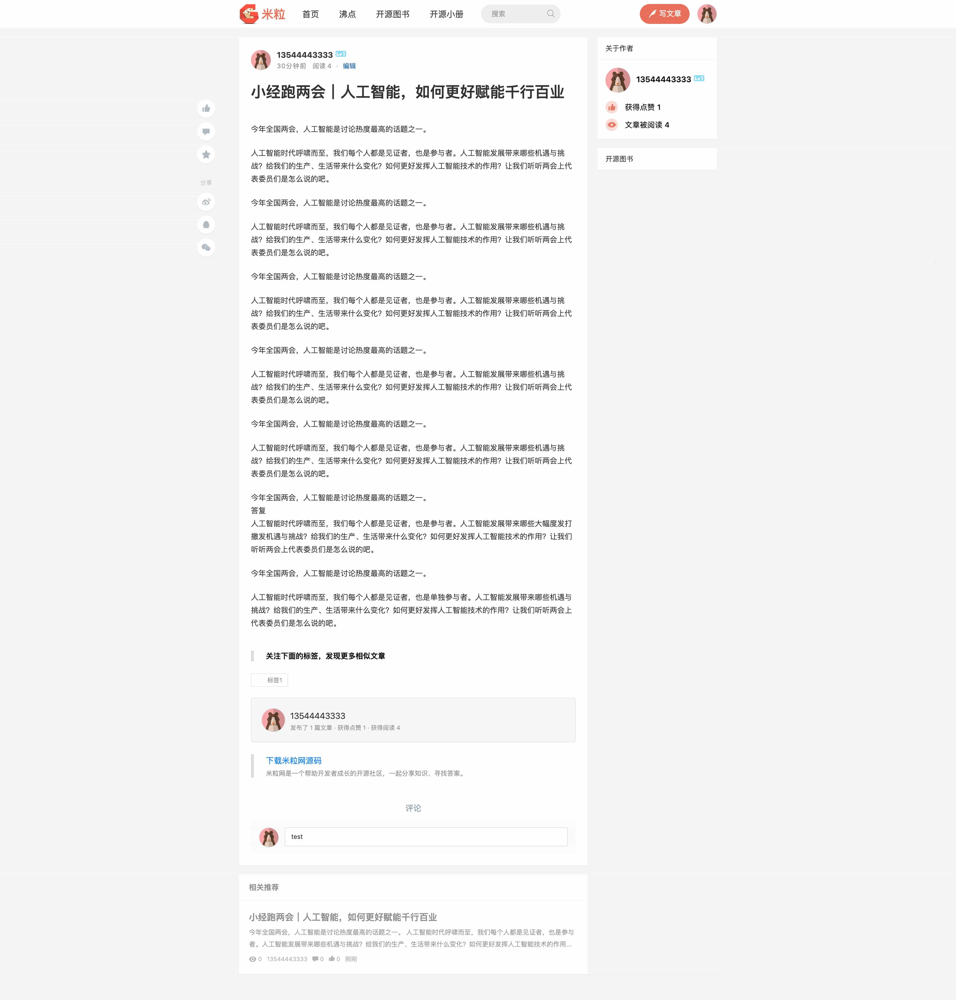

# mili

[中文](./README.md) | English

**mili** is an elegant open-source community system with rich features.
It has been deployed at [Mili Network](https://www.golang123.com). You can use it to build your own community. The frontend of **mili** is developed using technologies like **vue** and **iview**, while the backend utilizes **typescript**, **nodejs**, **nestjs**, **typeorm**, and more.

## 🎆 Screenshots
.jpg)



## 👉 Software Dependencies
| Software | Version |
|:---------|:-------:|
| nginx    | 1.17.1  |
| node.js  | 8.4.0   |
| mysql    | 5.6.35  |
| redis    | 4.0.1   |

## Quickstart
One-step setup

```bash
git clone https://github.com/eric-gitta-moore/mili.git
cd mili
docker compose up -d
```


## Running with Docker
> Ensure you have 🪜 access throughout, otherwise you won't be able to pull from docker.io and ghcr.io
>
> For macOS, OrbStack is recommended (note: Rosetta required), for Windows, WSL2 is recommended

```bash
# For macOS with Apple Silicon
# Due to potential compatibility issues with some components on ARM architecture,
# x86_64 emulation is needed
export DOCKER_DEFAULT_PLATFORM=linux/amd64

# For regular environments
# If you need to build, uncomment the build section in docker-compose.yaml
docker compose up -d --build
```

> Note: On Macs with Apple Silicon chips, some dependencies may need to run in x86_64 architecture to avoid compatibility issues. Using `--platform linux/amd64` ensures the container runs in an emulated x86_64 environment.

## Local Development
It is STRONGLY recommended to use Docker Compose for running the application.
Otherwise, you might encounter various issues on macOS Apple Silicon Chip, including but not limited to Python2, Node 8, node-sass, C++, npm git issues, and database-related problems.

Homepage: http://localhost:9906

Admin Panel: http://localhost:9906/admin/

API: http://localhost:9905

Username: 13544443333

Password: 13544443333

## ⚙️ Configuration
### Configure hosts
127.0.0.1 local.nodejs123.com

### Configure nginx
Please refer to the following configuration and modify the log directory accordingly:

```nginx
upstream nodejsAPI {
    server 127.0.0.1:9905;
}

upstream nodejsStatic {
    server 127.0.0.1:9906;
}

server {
    listen       80;
    server_name dev.golang123.com;

    access_log /your/path/logs/golang123.access.log;
    error_log /your/path/logs/golang123.error.log;

    location /js  {
        proxy_pass  http://nodejsStatic;
        proxy_set_header   Host             $host;
        proxy_set_header   X-Real-IP        $remote_addr;
        proxy_set_header   X-Forwarded-For  $proxy_add_x_forwarded_for;
    }

    location /styles  {
        proxy_pass  http://nodejsStatic;
        proxy_set_header   Host             $host;
        proxy_set_header   X-Real-IP        $remote_addr;
        proxy_set_header   X-Forwarded-For  $proxy_add_x_forwarded_for;
    }

    location /images  {
        proxy_pass  http://nodejsStatic;
        proxy_set_header   Host             $host;
        proxy_set_header   X-Real-IP        $remote_addr;
        proxy_set_header   X-Forwarded-For  $proxy_add_x_forwarded_for;
    }

    location /fonts  {
        proxy_pass  http://nodejsStatic;
        proxy_set_header   Host             $host;
        proxy_set_header   X-Real-IP        $remote_addr;
        proxy_set_header   X-Forwarded-For  $proxy_add_x_forwarded_for;
    }

    location /sockjs-node {
        proxy_pass http://nodejsStatic;
        proxy_read_timeout 3600s;
        proxy_http_version 1.1;
        proxy_set_header Upgrade $http_upgrade;
        proxy_set_header Connection "upgrade";
    }

    location /webpack-dev-server {
        proxy_pass  http://nodejsStatic;
        proxy_set_header   Host             $host;
        proxy_set_header   X-Real-IP        $remote_addr;
        proxy_set_header   X-Forwarded-For  $proxy_add_x_forwarded_for;
    }

    location /api/v1 {
        proxy_pass  http://nodejsAPI;
        proxy_set_header   Host             $host;
        proxy_set_header   X-Real-IP        $remote_addr;
        proxy_set_header   X-Forwarded-For  $proxy_add_x_forwarded_for;
        proxy_set_header   x-forwarded-proto  https;
    }
    
    location / {
        proxy_pass  http://nodejsAPI;
        proxy_set_header   Host             $host;
        proxy_set_header   X-Real-IP        $remote_addr;
        proxy_set_header   X-Forwarded-For  $proxy_add_x_forwarded_for;
        proxy_set_header   x-forwarded-proto  https;
    }
}
```

### Configure Database
Please modify the MySQL configuration in {project_directory}/src/config/cfg.default.ts