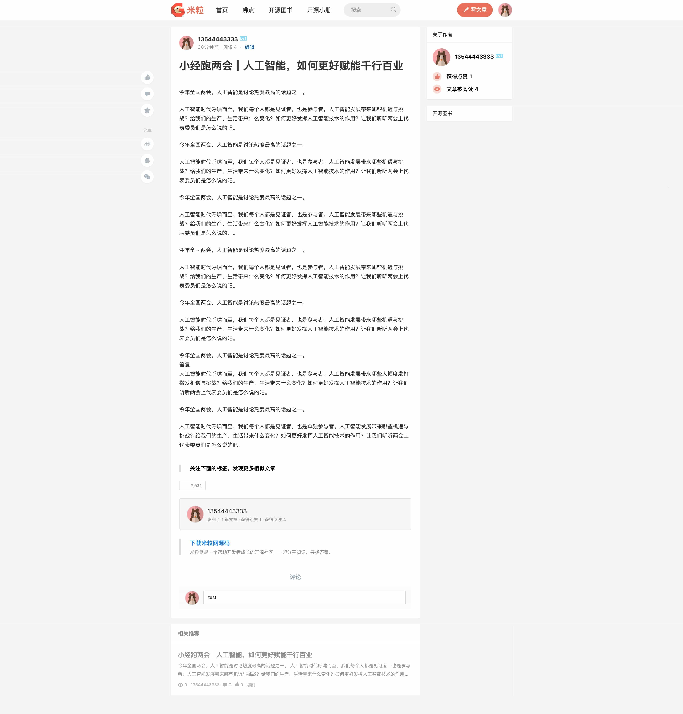

mili   
=

**mili**是一个开源的社区系统，界面优雅，功能丰富。
已在[米粒网](https://www.golang123.com) 得到应用，你完全可以用它来搭建自己的社区。**mili**的前端使用**vue**、**iview**等技术来开发，后端使用**typescript**、**nodejs**、**nestjs**、**typeorm**等技术来开发。 

## 🎆 系统截图
.jpg)



## 👉 依赖的软件
| 软件 | 版本|  
|:---------|:-------:|
| nginx  |  1.17.1 |
| node.js     |  8.4.0 |
| mysql  |  5.6.35 |
| redis  |  4.0.1 |


## Quickstart
一步到位

```bash
wget https://github.com/eric-gitta-moore/mili/raw/master/docker-compose.yaml

docker compose up -d
```


## Docker 运行
> 确保全程 🪜 在线，不然 docker.io 和 ghcr.io 拉不下来
>
> macOS 建议使用 OrbStack (注意需要安装 Rosetta)，Windows 建议使用 WSL2

```bash
# macOS M芯片(Apple Silicon)环境运行
# 由于项目依赖的一些组件在ARM架构上可能存在兼容性问题，需要使用x86_64模拟运行
export DOCKER_DEFAULT_PLATFORM=linux/amd64

# 普通环境运行
# 如果需要构建的话，需要在 docker-compose.yaml 中取消 build 的注释
docker compose up -d --build
```

> 注意：在 Apple Silicon 芯片的 Mac 上，某些依赖可能需要使用 x86_64 架构运行以避免兼容性问题。使用 `--platform linux/amd64` 参数可以确保容器在模拟的 x86_64 环境中运行。

## 本地开发
强烈强烈强烈建议用 Docker Compose 来运行

不然 macOS Apple Silicon Chip 跑会搞死人，包括但不限于 Python2、Node 8、node-sass、C++、npm拉git 问题，还有数据库缺胳膊少腿

首页: http://localhost:9906

管理后台: http://localhost:9906/admin/

API: http://localhost:9905

用户名: 13544443333

密码: 13544443333


## ⚙️ 配置
### 配置hosts
127.0.0.1 local.nodejs123.com  

### 配置nginx 
请参考如下配置, 请修改日志目录

```
upstream nodejsAPI {
    server 127.0.0.1:9905;
}

upstream nodejsStatic {
    server 127.0.0.1:9906;
}

server {
    listen       80;
    server_name dev.golang123.com;

    access_log /your/path/logs/golang123.access.log;
    error_log /your/path/logs/golang123.error.log;

    location /js  {
        proxy_pass  http://nodejsStatic;
        proxy_set_header   Host             $host;
        proxy_set_header   X-Real-IP        $remote_addr;
        proxy_set_header   X-Forwarded-For  $proxy_add_x_forwarded_for;
    }

    location /styles  {
        proxy_pass  http://nodejsStatic;
        proxy_set_header   Host             $host;
        proxy_set_header   X-Real-IP        $remote_addr;
        proxy_set_header   X-Forwarded-For  $proxy_add_x_forwarded_for;
    }

    location /images  {
        proxy_pass  http://nodejsStatic;
        proxy_set_header   Host             $host;
        proxy_set_header   X-Real-IP        $remote_addr;
        proxy_set_header   X-Forwarded-For  $proxy_add_x_forwarded_for;
    }

    location /fonts  {
        proxy_pass  http://nodejsStatic;
        proxy_set_header   Host             $host;
        proxy_set_header   X-Real-IP        $remote_addr;
        proxy_set_header   X-Forwarded-For  $proxy_add_x_forwarded_for;
    }

    location /sockjs-node {
        proxy_pass http://nodejsStatic;
        proxy_read_timeout 3600s;
        proxy_http_version 1.1;
        proxy_set_header Upgrade $http_upgrade;
        proxy_set_header Connection "upgrade";
    }

    location /webpack-dev-server {
        proxy_pass  http://nodejsStatic;
        proxy_set_header   Host             $host;
        proxy_set_header   X-Real-IP        $remote_addr;
        proxy_set_header   X-Forwarded-For  $proxy_add_x_forwarded_for;
    }

    location /api/v1 {
        proxy_pass  http://nodejsAPI;
        proxy_set_header   Host             $host;
        proxy_set_header   X-Real-IP        $remote_addr;
        proxy_set_header   X-Forwarded-For  $proxy_add_x_forwarded_for;
        proxy_set_header   x-forwarded-proto  https;
    }
    
    location / {
        proxy_pass  http://nodejsAPI;
        proxy_set_header   Host             $host;
        proxy_set_header   X-Real-IP        $remote_addr;
        proxy_set_header   X-Forwarded-For  $proxy_add_x_forwarded_for;
        proxy_set_header   x-forwarded-proto  https;
    }
}
```

### 配置数据库
请修改{项目目录}/src/config/cfg.default.ts 文件中mysql的配置
```
export default {
    db: {
        type: 'mysql',
        host: 'localhost',
        port: 3306,
        ...
    },
    redis: {
        host: '127.0.0.1',
        port: 6379,
        keyPrefix: 'mili:',
        family: 4, // 4 (IPv4) or 6 (IPv6)
        password: '',
        db: 0,
    },
    ...
}
```

## 🚀 安装
### 安装依赖的模块
进入项目目录，输入命令
```
npm install
```

进入 {项目目录}/pc 目录下，输入命令
```
npm install
```

再输入
```
npm start
```

## 🚕 运行
### 配置vscode
```
{
    "version": "0.2.0",
    "configurations": [
        {
            "type": "node",
            "request": "launch",
            "name": "Launch Program",
            "runtimeArgs": [
                "--nolazy",
                "-r",
                "ts-node/register",
            ],
            "args": [
                "${workspaceFolder}/src/main.ts",
                "|",
                "./node_modules/.bin/pino-pretty"
            ],
            "env": {
                "NODE_ENV": "development"
            },
            "sourceMaps": true,
            "cwd": "${workspaceFolder}",
            "protocol": "inspector",
            "console": "integratedTerminal",
            "internalConsoleOptions": "neverOpen"
        }
    ]
}
```

### 通过vscode来运行
按快捷键`F5`来运行项目

### 本地访问
首页: http://local.nodejs123.com    
管理后台: http://local.nodejs123.com/admin/  
用户名: mili  
密码: 123456

### 线上体验
https://www.nodejs123.com    

## 📊 监控系统

### Graphite
Graphite 是一个用于收集、存储和可视化时间序列数据的开源监控系统。在本项目中，我们使用 Graphite 来收集和存储性能指标数据。

#### 访问 Graphite
- Web 界面: http://localhost:8880
- 默认用户名: root
- 默认密码: root

#### 数据收集端口
- Carbon 缓存: 2003-2004 (接收指标数据)
- Carbon 聚合: 2023-2024
- StatsD UDP: 8125 (接收应用程序统计数据)
- StatsD 管理: 8126

### Grafana
Grafana 是一个强大的可视化和分析平台，可以将来自 Graphite 等多个数据源的数据以漂亮的仪表板形式展示。

#### 访问 Grafana
- Web 界面: http://localhost:3000
- 默认用户名: admin
- 默认密码: admin

#### 配置 Graphite 数据源
1. 登录 Grafana
2. 点击左侧菜单的 "Configuration" (⚙️) 图标
3. 选择 "Data sources"
4. 点击 "Add data source"
5. 选择 "Graphite"
6. 配置以下信息：
   - Name: Graphite
   - URL: http://graphite:80
   - Access: Server (default)
7. 点击 "Save & Test" 验证连接

#### 创建仪表板
1. 点击左侧 "+" 图标
2. 选择 "Create Dashboard"
3. 点击 "Add visualization"
4. 选择 "Graphite" 数据源
5. 在查询编辑器中构建你的查询

常用指标示例：
- CPU 使用率: `stats.gauges.system.cpu.*`
- 内存使用: `stats.gauges.system.memory.*`
- API 响应时间: `stats.timers.api.*`
- 请求计数: `stats.counters.http.*`

## License
[GPL](https://github.com/shen100/golang123-api/blob/master/LICENSE "")      
Mili is GPL licensed.
